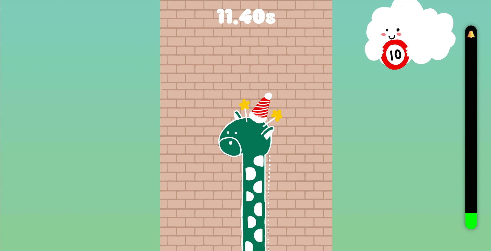

# 🦒 그린이 목늘리기

스페이스바를 연타해서 그리디 마스코트인 기린 **'그린이'**의 목을 늘려  
세종대학교 시계탑의 종을 울리는 게임!

---

## 🎮 게임 개요

- **목표:** 제한 시간 15초 안에 스페이스바를 연타하여 그린이의 목을 빠르게 위로 늘리세요!
- **배경:** 세종대학교 시계탑 안에 진짜 기린이 살고 있다는 전설... 이 전설의 진실을 확인해보세요!
- **포인트:**  
  - 스페이스바 입력에 따라 그린이의 목이 **위아래로 번갈아가며 늘어남**
  - **100회 입력 달성 시 종 🔔 이 울리고 성공!**
  - 자신의 기록을 **랭킹에 등록**할 수 있어요.

---

## ⏱️ 게임 방식

1. 시작 시 **4자리 ID** 입력 (공백 없이)
2. `스페이스바`를 누르면 게임 시작
3. **15초 내에 100번 누르면 성공**
4. 성공 시 결과 타임 + 랭킹 등록
5. `R` 키를 누르면 게임을 다시 시작할 수 있어요

---

## 🖼️ 게임 화면 예시



---

## ⚙️ 로컬 실행 방법

이 프로젝트는 **Node.js와 npm이 설치된 환경**에서 실행됩니다.


### 1. 저장소 클론
```sh
# 터미널에서 실행
git clone https://github.com/INSANE-P/Greenie-neck-stretch.git
cd Greenie-neck-stretch
```


### 2. 패키지 설치
```sh
# 터미널에서 실행
npm install
```


### 3. 환경 변수 설정
```env
# .env 내부
REACT_APP_API_TOKEN=여기에_실제_토큰_값
```


### 4. 개발 서버 실행
```sh
# 터미널에서 실행
npm start
